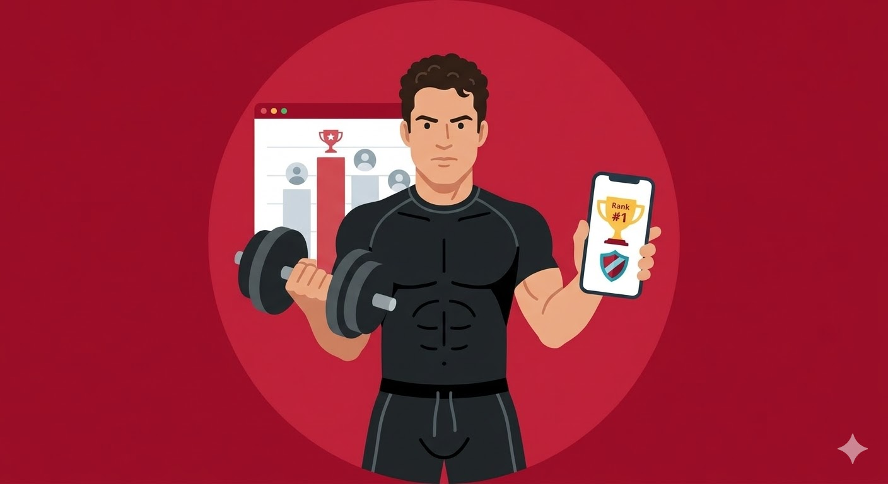

# 2. Nosso Produto

_Esta seção detalha a estratégia do UpFit, definindo seu objetivo central e os limites do que a solução se propõe a entregar._

## 2.1 Visão do Produto

Para jovens adultos (18-35 anos) que lutam para manter a constância nos treinos, o UpFit é uma plataforma de gamificação social que transforma o esforço físico em progressão visual e conquistas épicas. Diferente de aplicativos fitness tradicionais que focam apenas em métricas brutas e dados clínicos, nosso produto entrega uma experiência onde a evolução é o reflexo direto da disciplina do usuário.

## 2.2 Nosso Produto

A matriz abaixo define o escopo do UpFit, diferenciando-o de aplicativos de saúde clínica ou treinamento personalizado e focando em sua proposta de valor: a gamificação da constância.

| **É**                                                                                                              | **Não é**                                                                                                               |
| :----------------------------------------------------------------------------------------------------------------- | :---------------------------------------------------------------------------------------------------------------------- |
| **Um Jogo da Vida Real:** Um sistema de progressão (XP, níveis) baseado em esforço físico real.              | **Um App Clínico/Médico:** Não faz diagnósticos, prescrição de dietas ou monitoramento de saúde severa.                 |
| **Um Hub de Motivação:** Focado em gamificação para combater a taxa de abandono nos primeiros 60 dias.             | **Um Personal Trainer Digital:** O foco não é ditar _como_ treinar, mas garantir que o usuário _vá_ treinar.            |
| **Uma Rede Social de Nicho:** Um ambiente de interação entre praticantes que compartilham objetivos de constância. | **Um Rastreador de Performance Extrema:** Não compete com apps de alta performance para atletas de elite (como Strava). |
| **Uma Camada de Engajamento:** Uma interface lúdica sobreposta à rotina de exercícios.                             | **Um Jogo Puramente Virtual:** O progresso exige obrigatoriamente uma ação no mundo físico (check-in).                  |

| **Faz**                                                                                                                | **Não faz**                                                                                                                 |
| :--------------------------------------------------------------------------------------------------------------------- | :-------------------------------------------------------------------------------------------------------------------------- |
| **Gamifica o Check-in:** Transforma a presença na atividade física em pontos de experiência (XP). | **Prescrição Avançada:** Não monta treinos complexos de periodização ou fichas técnicas detalhadas.                         |
| **Cria Comunidade:** Permite interação social, visualização da evolução de amigos e formação de comunidades.        | **Contagem de Calorias:** Não foca no controle rigoroso de ingestão calórica ou macronutrientes.                            |
| **Visualiza o Progresso:** Oferece recompensas visuais (itens, badges) para tornar o esforço físico algo tangível.     | **Integração com Wearables (Fase Inicial):** O escopo foca na validação da constância, sem dependência inicial de hardware. |
| **Gerencia Conquistas:** Estabelece desafios e séries (streaks) para incentivar a frequência diária.                   | **Venda de Suplementos:** O foco é a experiência de software e retenção do usuário, não o e-commerce.                       |

## 2.3 Personas

_As personas abaixo representam os perfis reais de usuários que o UpFit busca engajar e reter. Foram construídas com base na proposta de valor do produto — gamificação da constância — e nos padrões de abandono observados nos primeiros 60 dias de prática física._

---

<h3>Persona 1 — O Iniciante Entusiasmado</h3>
<table>
  <tr>
    <td style="vertical-align: top; width: 150px;">
      
    </td>
    <td style="vertical-align: top; padding-left: 10px;">
      <strong>Nome:</strong> Lucas Mendes  
      <strong>Idade:</strong> 22 anos  
      <strong>Hobby:</strong> Games online (RPG e Battle Royale), séries de fantasia  
      <strong>Trabalho:</strong> Estudante universitário de Engenharia de Computação  
      <strong>Personalidade:</strong> Entusiasta, competitivo e movido por recompensas  
      <strong>Sonho:</strong> Ganhar massa muscular e se sentir mais confiante até o fim do ano  
      <strong>Dores:</strong> Começa a academia motivado, mas abandona após 3–4 semanas por falta de resultados visíveis imediatos e monotonia da rotina  
      <strong>Comportamento:</strong> Passa horas evoluindo personagens em jogos, mas não consegue aplicar a mesma dedicação ao treino físico; sente falta de um senso de progressão claro e recompensas tangíveis  
      <strong>Motivação com o UpFit:</strong> Enxerga o sistema de XP, níveis e avatar como um "personagem de RPG que ele mesmo é" — a evolução visual do avatar representa diretamente seu esforço físico real, tornando cada treino uma missão a ser completada  
    </td>
  </tr>
</table>

---

<h3>Persona 2 — A Profissional Sobrecarregada</h3>
<table>
  <tr>
    <td style="vertical-align: top; width: 150px;">
      
    </td>
    <td style="vertical-align: top; padding-left: 10px;">
      <strong>Nome:</strong> Carla Ferreira  
      <strong>Idade:</strong> 29 anos  
      <strong>Hobby:</strong> Podcasts de produtividade, corrida casual nos fins de semana  
      <strong>Trabalho:</strong> Analista de Marketing em uma agência digital  
      <strong>Personalidade:</strong> Determinada, social e orientada a metas  
      <strong>Sonho:</strong> Consolidar um hábito de exercício consistente que se encaixe na rotina agitada sem culpa  
      <strong>Dores:</strong> Treina sozinha e perde a motivação com facilidade; a rotina de trabalho consome energia e o treino é sempre o primeiro item a ser cortado do dia  
      <strong>Comportamento:</strong> Usa vários aplicativos de produtividade e aprecia rankings e comparações; quando faz parte de um grupo com objetivo comum, cumpre mais seus compromissos  
      <strong>Motivação com o UpFit:</strong> A funcionalidade de guildas e o feed social permitam que ela se sinta parte de uma comunidade com objetivos parecidos; a streak diária cria um senso de responsabilidade coletiva que a impede de "furar" o treino  
    </td>
  </tr>
</table>

---

<h3>Persona 3 — O Praticante Estagnado</h3>
<table>
  <tr>
    <td style="vertical-align: top; width: 150px;">
      
    </td>
    <td style="vertical-align: top; padding-left: 10px;">
      <strong>Nome:</strong> Rafael Costa  
      <strong>Idade:</strong> 33 anos  
      <strong>Hobby:</strong> Crossfit, assiste a competições esportivas, filmes de ação  
      <strong>Trabalho:</strong> Analista de TI em empresa de médio porte  
      <strong>Personalidade:</strong> Competitivo, disciplinado e orientado a desafios  
      <strong>Sonho:</strong> Superar seus próprios limites e se manter entre os mais constantes do grupo  
      <strong>Dores:</strong> Já treina há algum tempo, mas sente que a rotina ficou monótona e sem novos objetivos; a ausência de comparação com pares desmotiva a consistência  
      <strong>Comportamento:</strong> Gosta de saber como está se saindo em relação a outros; utiliza rankings e placar para se autodesafiar; sente falta de conquistas e recompensas por milestones de longo prazo  
      <strong>Motivação com o UpFit:</strong> Os rankings de guildas, os desafios coletivos e o sistema de badges por conquistas acumuladas alimentam sua veia competitiva, transformando a constância em um jogo social que ele quer liderar  
    </td>
  </tr>
</table>
