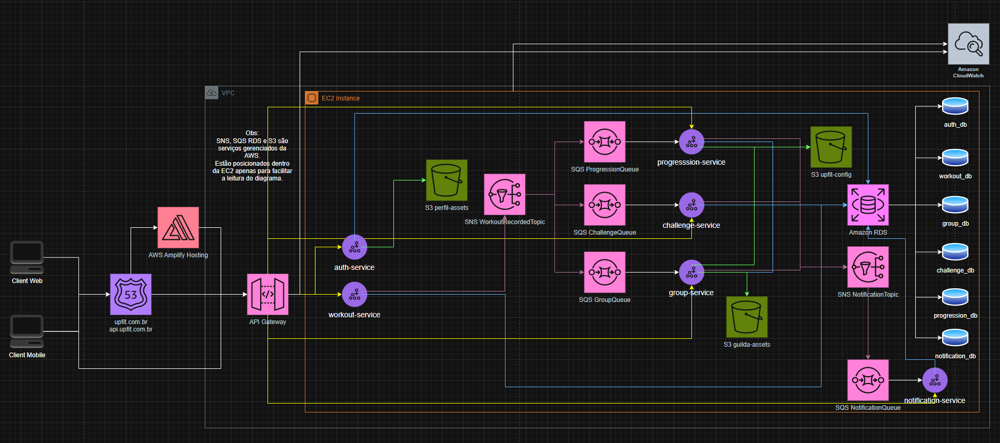
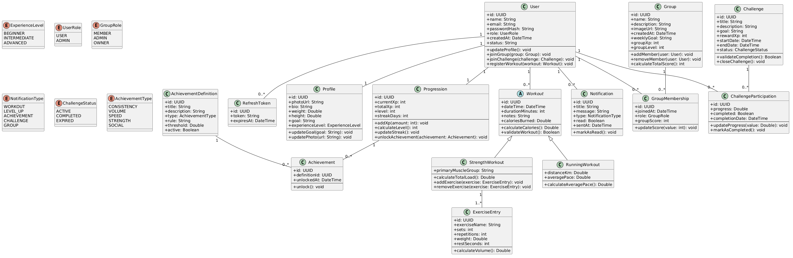
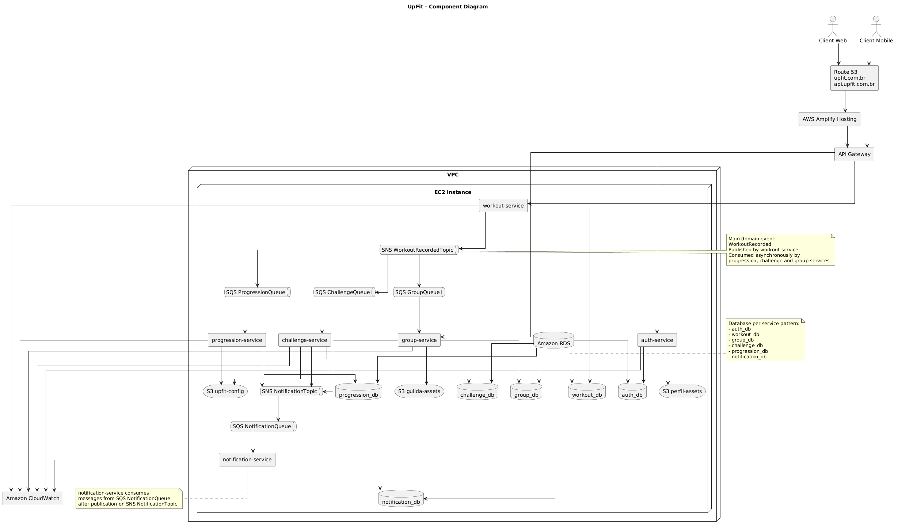

# 4. Modelagem e Projeto Arquitetural

A arquitetura do sistema **UpFit** foi projetada utilizando uma abordagem baseada em **microserviços**, com o objetivo de promover modularidade, escalabilidade e facilidade de manutenção.

O acesso ao sistema ocorre por meio de um cliente que realiza requisições ao domínio gerenciado pelo **Amazon Route 53**. O tráfego destinado ao frontend é direcionado para o **AWS Amplify**, responsável pela hospedagem da aplicação web desenvolvida em **React.js**. Já as requisições para os serviços do backend são encaminhadas ao **Amazon API Gateway**, que atua como ponto de entrada das APIs do sistema.

Os microserviços do backend são executados em uma instância **Amazon EC2** e foram desenvolvidos utilizando **Java com o framework Spring Boot**. Cada serviço é responsável por um domínio específico da aplicação, como autenticação, gerenciamento de treinos, grupos, desafios e notificações.

A comunicação entre os serviços ocorre tanto de forma síncrona, por meio das APIs expostas, quanto de forma assíncrona, utilizando **Amazon SNS** e **Amazon SQS** para processamento de eventos.

A persistência de dados é realizada através do **Amazon RDS**, com separação lógica dos bancos por domínio de serviço. Arquivos e ativos da aplicação são armazenados no **Amazon S3**, enquanto o monitoramento e os logs do sistema são centralizados no **Amazon CloudWatch**.

A Figura 1 apresenta uma visão geral da arquitetura da solução e os principais componentes que compõem o sistema.

**Figura 1 - Visão Geral da Solução**

## 4.1. Histórias de Usuário (Baseadas em Personas)

As histórias de usuário do UpFit foram elaboradas com base nas personas definidas no projeto, refletindo suas dores, comportamentos e motivações. Cada história representa uma necessidade real do usuário e o valor que o sistema deve entregar.

---

### 🧍 Persona 1 — Lucas (Iniciante Entusiasmado)

|EU COMO... `PERSONA`| QUERO/PRECISO ... `FUNCIONALIDADE` |PARA ... `MOTIVO/VALOR`|
|--------------------|------------------------------------|----------------------------------------|
|EU COMO Lucas, iniciante que gosta de jogos| Quero visualizar meu progresso em níveis e XP | Para sentir que estou evoluindo como em um jogo e manter minha motivação |
|EU COMO Lucas| Quero receber recompensas visuais ao treinar | Para transformar cada treino em uma conquista tangível |
|EU COMO Lucas| Quero registrar meus treinos facilmente | Para acumular XP e evoluir dentro da plataforma |
|EU COMO Lucas| Quero desbloquear conquistas ao atingir metas | Para sentir progresso claro e continuar engajado |
|EU COMO Lucas| Quero manter uma sequência de treinos (streak) | Para não perder o ritmo e continuar evoluindo |
|EU COMO Lucas| Quero ver minha evolução representada no sistema | Para não desistir por falta de resultados visíveis imediatos |

---

### 👩 Persona 2 — Carla (Profissional Sobrecarregada)

|EU COMO... `PERSONA`| QUERO/PRECISO ... `FUNCIONALIDADE` |PARA ... `MOTIVO/VALOR`|
|--------------------|------------------------------------|----------------------------------------|
|EU COMO Carla, profissional com rotina intensa| Quero participar de uma comunidade | Para me sentir parte de um grupo com objetivos em comum |
|EU COMO Carla| Quero visualizar o progresso de outros usuários | Para me motivar ao ver que outras pessoas também estão treinando |
|EU COMO Carla| Quero manter uma sequência de treinos (streak) | Para criar um hábito consistente mesmo com rotina apertada |
|EU COMO Carla| Quero receber notificações de incentivo | Para não esquecer de treinar nos dias mais corridos |
|EU COMO Carla| Quero participar de desafios | Para manter minha motivação com metas claras |
|EU COMO Carla| Quero comparar meu desempenho com o grupo | Para aumentar minha responsabilidade e comprometimento |

---

### 🧍‍♂️ Persona 3 — Rafael (Praticante Estagnado)

|EU COMO... `PERSONA`| QUERO/PRECISO ... `FUNCIONALIDADE` |PARA ... `MOTIVO/VALOR`|
|--------------------|------------------------------------|----------------------------------------|
|EU COMO Rafael, praticante experiente| Quero participar de rankings de grupo | Para competir e me manter entre os mais constantes |
|EU COMO Rafael| Quero participar de desafios coletivos | Para ter novos objetivos e evitar monotonia |
|EU COMO Rafael| Quero desbloquear conquistas por performance | Para reconhecer meu esforço ao longo do tempo |
|EU COMO Rafael| Quero comparar meu desempenho com outros usuários | Para me desafiar continuamente |
|EU COMO Rafael| Quero acompanhar meu progresso ao longo do tempo | Para entender minha evolução e manter consistência |
|EU COMO Rafael| Quero contribuir para o desempenho da minha comunidade | Para reforçar minha competitividade e engajamento |

---

### 👤 Funcionalidades Gerais (Transversais às Personas)

|EU COMO... `PERSONA`| QUERO/PRECISO ... `FUNCIONALIDADE` |PARA ... `MOTIVO/VALOR`|
|--------------------|------------------------------------|----------------------------------------|
|EU COMO usuário do sistema| Quero criar uma conta | Para começar a usar a plataforma |
|EU COMO usuário do sistema| Quero fazer login | Para acessar minhas informações |
|EU COMO usuário do sistema| Quero registrar um treino | Para receber XP e progredir |
|EU COMO usuário do sistema| Quero visualizar meu histórico de treinos | Para acompanhar minha consistência |
|EU COMO usuário do sistema| Quero subir de nível | Para sentir progresso contínuo |
|EU COMO usuário do sistema| Quero receber notificações | Para me manter engajado na plataforma |

## 4.2. Visão Lógica

A visão lógica da arquitetura do sistema tem como objetivo apresentar a organização estrutural dos principais elementos que compõem a solução proposta. Por meio dessa visão, é possível compreender como os componentes do sistema estão estruturados, como se relacionam entre si e quais responsabilidades são atribuídas a cada parte da aplicação.

Para representar essa organização, foram utilizados dois tipos principais de diagramas: o **Diagrama de Classes** e o **Diagrama de Componentes**. Esses diagramas permitem visualizar tanto a estrutura conceitual das entidades do sistema quanto a divisão arquitetural da aplicação em módulos e serviços.

O **Diagrama de Classes** é utilizado para representar as principais entidades do domínio da aplicação, bem como seus atributos, relacionamentos e responsabilidades dentro do sistema. Esse diagrama auxilia na compreensão da modelagem dos dados e das relações existentes entre os elementos que compõem o domínio do UpFit.

Já o **Diagrama de Componentes** apresenta uma visão de mais alto nível da arquitetura da aplicação, evidenciando os principais componentes do sistema, suas responsabilidades e as interfaces de comunicação entre eles. Esse diagrama também permite identificar os elementos reutilizados da infraestrutura tecnológica, como serviços da plataforma AWS, bem como os componentes que precisam ser desenvolvidos especificamente para o sistema.

Dessa forma, os diagramas apresentados a seguir contribuem para uma melhor compreensão da estrutura lógica da solução e das decisões arquiteturais adotadas no projeto.

### 4.3. Diagrama de Classes

**Figura 2 – Diagrama de classes. Fonte: o próprio autor.**

O diagrama de classes apresenta a modelagem conceitual das principais entidades que compõem o domínio da aplicação **UpFit**, bem como os relacionamentos entre elas. Essa modelagem serve como base para a organização dos dados e para a implementação das funcionalidades do sistema.

No centro do modelo está a classe **User**, que representa os usuários da plataforma. Cada usuário possui um **Profile**, que armazena informações adicionais como foto, peso, altura, objetivos e nível de experiência. Os usuários podem registrar diferentes **Workouts**, que representam as atividades físicas realizadas. O modelo também permite especializações de treino, como **RunningWorkout** e **StrengthWorkout**, permitindo representar diferentes tipos de atividades e suas métricas específicas.

Os usuários também podem participar de **Groups**, que representam comunidades dentro da plataforma. A relação entre usuários e grupos é gerenciada pela classe **GroupMembership**, responsável por armazenar informações como data de entrada e papel do usuário no grupo (por exemplo, membro, administrador ou proprietário).

A aplicação também permite a criação de **Challenges**, que representam desafios de atividade física com objetivos específicos. A participação dos usuários nesses desafios é controlada pela classe **ChallengeParticipation**, que registra o progresso e o status de conclusão de cada participante.

Para acompanhar a evolução do usuário dentro da plataforma, o sistema utiliza a classe **Progression**, responsável por registrar métricas como experiência acumulada, nível atual e sequência de dias ativos (streak). Associado a essa evolução, o sistema também possui a classe **Achievement**, que representa conquistas desbloqueadas pelos usuários ao atingirem determinados objetivos.

Além disso, o sistema conta com a classe **Notification**, responsável por gerenciar notificações enviadas aos usuários em eventos relevantes do sistema, como conclusão de treinos, participação em desafios ou desbloqueio de conquistas.

Por fim, o modelo também utiliza **enumerações** para representar valores fixos utilizados pelo sistema, como níveis de experiência (**ExperienceLevel**), papéis em grupos (**GroupRole**), tipos de notificação (**NotificationType**), tipos de desafios (**AchievementType**) e status de desafios (**ChallengeStatus**).

Dessa forma, o diagrama de classes apresenta uma visão estruturada das entidades do domínio do sistema UpFit e das relações entre elas, servindo como base para o desenvolvimento da lógica de negócio e para a organização da persistência de dados da aplicação.

### 4.4. Diagrama de Componentes

O diagrama de componentes apresenta a organização arquitetural do sistema UpFit, evidenciando os principais módulos da aplicação, suas responsabilidades e as interfaces de comunicação entre eles. A arquitetura adotada segue o estilo **baseado em microserviços**, no qual diferentes domínios do sistema são implementados como serviços independentes que se comunicam por meio de APIs REST e mecanismos de mensageria.

A solução é composta por dois principais tipos de clientes: uma aplicação **Web**, desenvolvida em **React.js** e hospedada na plataforma **AWS Amplify**, e uma aplicação **Mobile**, desenvolvida em **Flutter**. Ambas consomem os serviços do backend por meio de requisições HTTP direcionadas ao **API Gateway**, utilizando um domínio, gerenciado pelo serviço **Amazon Route 53**, responsável pela resolução DNS da aplicação.

O **API Gateway** atua como ponto central de entrada para as requisições externas, encaminhando-as para os microserviços responsáveis por cada domínio funcional do sistema. Entre esses serviços estão o **auth-service**, responsável pela autenticação e gerenciamento de usuários; o **workout-service**, responsável pelo registro e gerenciamento de treinos; o **group-service**, que gerencia grupos de usuários; o **challenge-service**, responsável pelos desafios do sistema; o **progression-service**, que controla o progresso dos usuários; e o **notification-service**, responsável pelo envio de notificações.

A arquitetura também utiliza comunicação assíncrona baseada em eventos. Quando um treino é registrado, o **workout-service** publica um evento no **SNS WorkoutRecordedTopic**, que distribui mensagens para diferentes filas **SQS**. Cada fila é consumida por um microserviço específico, permitindo o processamento desacoplado de funcionalidades como atualização de progresso, validação de desafios, cálculo de rankings de grupo e envio de notificações.

No que se refere à persistência de dados, cada domínio funcional possui seu próprio banco de dados dentro do **Amazon RDS**, garantindo isolamento de dados e melhor organização da informação. Além disso, o sistema utiliza o **Amazon S3** para armazenamento de arquivos, como imagens de perfil dos usuários e recursos associados a grupos.

Para monitoramento e observabilidade da aplicação, todos os serviços enviam logs e métricas para o **Amazon CloudWatch**, permitindo o acompanhamento da execução do sistema, identificação de falhas e análise de desempenho.

Dessa forma, a arquitetura proposta promove **baixo acoplamento entre os serviços**, **alta escalabilidade** e **facilidade de manutenção**, permitindo que diferentes partes do sistema evoluam de forma independente.

**Figura 3 – Diagrama de Componentes. Fonte: o próprio autor.**
Conforme apresentado no diagrama da Figura 3, os principais componentes da solução são:

- **Cliente Web** – Aplicação web acessada por navegadores e desenvolvida utilizando o framework React.js. Essa aplicação é responsável pela interface de interação dos usuários com o sistema e é hospedada na plataforma AWS Amplify.

- **Cliente Mobile** – Aplicação mobile desenvolvida com o framework Flutter, responsável por fornecer acesso às funcionalidades da plataforma UpFit em dispositivos móveis. O aplicativo consome os serviços do backend por meio de chamadas HTTP à API.

- **Route 53** – Serviço de DNS da AWS responsável por gerenciar os domínios da aplicação, como `upfit.com.br` e `api.upfit.com.br`, direcionando as requisições para os serviços apropriados.

- **API Gateway** – Componente responsável por centralizar e gerenciar o acesso aos microserviços da aplicação. Atua como ponto único de entrada para requisições externas, encaminhando-as para os serviços internos.

- **auth-service** – Serviço responsável pela autenticação e gerenciamento de usuários, incluindo cadastro, login e controle de credenciais.

- **workout-service** – Serviço responsável pelo registro e gerenciamento de treinos realizados pelos usuários.

- **group-service** – Serviço responsável pela criação e gerenciamento de grupos de usuários dentro da plataforma.

- **challenge-service** – Serviço responsável pela criação e validação de desafios relacionados à prática de atividades físicas.

- **progression-service** – Serviço responsável pelo cálculo e atualização do progresso dos usuários na plataforma.

- **notification-service** – Serviço responsável pelo envio de notificações relacionadas a eventos da aplicação.

- **SNS WorkoutRecordedTopic** – Tópico de mensageria responsável por distribuir eventos gerados quando um treino é registrado.

- **SNS NotificationTopic** – Tópico de mensageria responsável por distribuir eventos que devem ser notificados.

- **SQS Queues** – Filas de mensagens utilizadas para comunicação assíncrona entre os serviços, permitindo o processamento desacoplado de eventos.

- **Amazon RDS** – Sistema de gerenciamento de banco de dados utilizado para armazenar os dados da aplicação, com bancos separados para cada domínio do sistema.

- **Amazon S3** – Serviço de armazenamento de objetos utilizado para armazenar arquivos estáticos, como imagens de perfil e recursos associados aos grupos.

- **Amazon CloudWatch** – Serviço utilizado para monitoramento, registro de logs e análise do comportamento da aplicação em produção.
